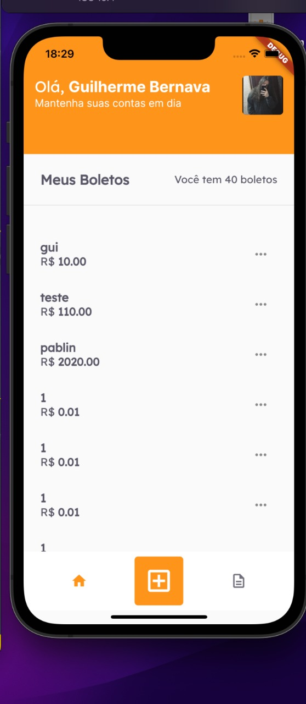
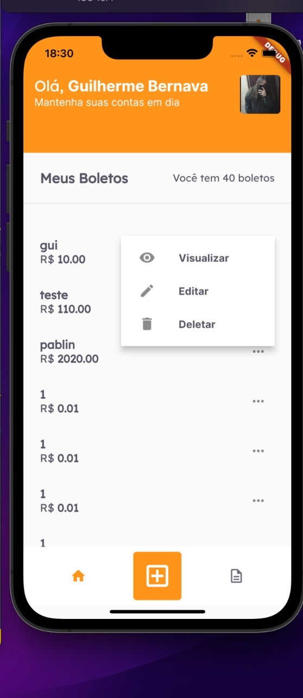
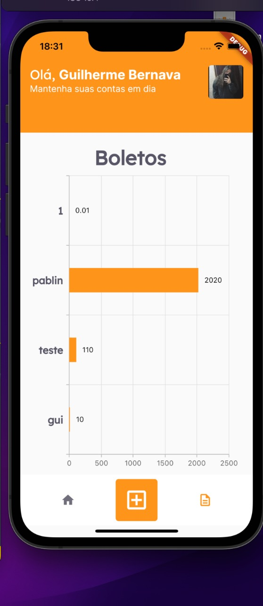

  

<h1> --PAYFLOW--</h1>

Payflow é um app de cadastro, edição e controle de boletos, onde você tem o total controle com os seus boletos, podendo escanea-lo e cadastrar dentro do app e tendo gráficos mostrandos seus boletos cadastrados.

 
 
 
<h2>📄 Tela de Boletos 📄</h2>

  

 

 

  

 
 
 
<h2📈 Gráfico de todos seus boletos 📈</h2>

  

 
 
 

<h1 align="center" > 🧪 Tecnologias Utilizadas </h1>

* FLUTTER
* FIREBASE
* XCODE
